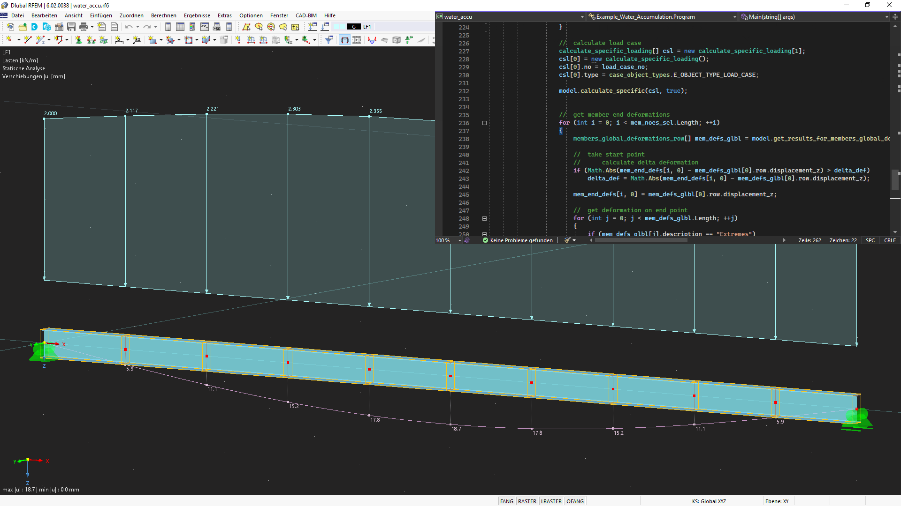

# Articles

## Get Started with C# HLF

The HLF library for C# offers many useful functions for creating structures in RFEM and RSTAB, some of which will be used in the following example.

Before the programmed code can be used, a connection to the program is required. To do this, one of the available ports must be set as the address. The default address of RFEM/RSTAB is [http://localhost:8081](http://localhost:8081). This can be changed in the program options if necessary.


In the next step, various objects such as nodes, lines and members can be created with the help of the available functions in the C# library. The library includes classes for all available objects. With the help of parameters, the properties of the objects can be determined and specified. The number of parameters can vary depending on the application. The following example of a node shows how objects can be defined:

```csharp
node newNode = new()
{
    no = nodeId,
    coordinates = new vector_3d() { x = xVector, y = 0.0, z = 0.0 },
    coordinate_system_type = node_coordinate_system_type.COORDINATE_SYSTEM_CARTESIAN,
    coordinate_system_typeSpecified = true,
    comment = "node for beam"
};
```
The definition of lines, areas and other objects is done analogously. It should be noted that for certain attributes an associated "Specified" attribute must also be defined and set to "true".

### Practice Example

This example shows how to create a continuous beam with constant line load. The number of fields, span and size of the line load can be defined variably via the user input. First, the required variables are defined via the user input in the console. The system checks whether the user's input is compatible with the data type of the respective variable. If the input is incorrect or empty, an error message appears in the console. During programming, care must be taken to ensure that decimal numbers can be entered using both dot and comma notation in order to minimise the susceptibility to errors during input.


#### Connection to RFEM/RSTAB

The following code attempts to establish a connection with RFEM/RSTAB within a Try-Catch-Block:

```csharp
var logger = LogManager.GetCurrentClassLogger();
string CurrentDirectory = Directory.GetCurrentDirectory();
try
{
    application_information ApplicationInfo;

    try
    {
        // connect to RFEM6 or RSTAB9 application
        application = new ApplicationClient(Binding, Address);
    }
    catch (Exception exception)
    {
        if (application != null)
        {
            if (application.State != CommunicationState.Faulted)
            {
                application.Close();
                logger.Error(exception, "Something happened:" + exception.Message);
            }
            else
            {
                application.Abort();
                logger.Error(exception, "Communication with RFEM faulted:" + exception.Message);
            }
        }
        Console.WriteLine(exception.ToString());
    }
    finally
    {
        ApplicationInfo = application.get_information();
        logger.Info("Name: {0}, Version:{1}, Type: {2}, language: {3} ", ApplicationInfo.name, ApplicationInfo.version, ApplicationInfo.type, ApplicationInfo.language_name);
        Console.WriteLine("Name: {0}, Version:{1}, Type: {2}, language: {3} ", ApplicationInfo.name, ApplicationInfo.version, ApplicationInfo.type, ApplicationInfo.language_name);
    }
}

string modelName = "MyTestModel";
string modelUrl ="";
ModelClient model = new ModelClient(Binding, new EndpointAddress(modelUrl));
```

For establishing a connection, the program must be opened before executing the code. After a successful connection, the program information is displayed in the console and a new model with a user-defined name is created in RFEM/RSTAB.

#### Definition of the Basic Objects

In the next step, the material and cross-section of the continuous beam can be defined. It is important that the names correspond to the names in the RFEM material or cross-section library.

```csharp
material materialConcrete = new material
{
    no = 1,
    name = "C20/25 | EN 1992-1-1:2004/A1:2014"
};

section sectionRectangle = new section
{
    no = 1,
    material = materialConcrete.no,
    materialSpecified = true,
    type = section_type.TYPE_PARAMETRIC_MASSIVE_I,
    typeSpecified = true,
    parametrization_type = section_parametrization_type.PARAMETRIC_MASSIVE_I__MASSIVE_RECTANGLE__R_M1,
    parametrization_typeSpecified = true,
    name = "R_M1 0.5/1.0"
};
```

Loops are used to create the various objects (nodes, lines, bars) and organise them in lists. The nodes are defined depending on the user-defined number of fields and transferred to the list "lineDefinitionNodes". This list is later used to create lines based on their definition nodes. If an RSTAB model is to be created, it is used to define the members by their definition nodes. When using RFEM, on the other hand, the members are defined by lines.

```csharp
SortedList<int, node> nodes = new SortedList<int, node>();
int[] lineDefinitionNodes = new int[spanNumber + 1];
int nodeId = 1;
double xVector = 0.0;

for (int i = 0; i < spanNumber + 1; i++)
{
    node newNode = new()
    {
        no = nodeId,
        coordinates = new vector_3d() { x = xVector, y = 0.0, z = 0.0 },
        coordinate_system_type = node_coordinate_system_type.COORDINATE_SYSTEM_CARTESIAN,
        coordinate_system_typeSpecified = true,
        comment = "concrete part"
    };
    nodes.Add(nodeId, newNode);
    lineDefinitionNodes[i] = nodeId;
    xVector = xVector + span;
    nodeId++;
}

// create lines
int lineId = 1;
SortedList<int, line> lines = new SortedList<int, line>();

for (int i = 0; i < spanNumber; i++)
{
    line newLine = new()
    {
        no = lineId,
        definition_nodes = new int[] { lineDefinitionNodes[i], lineDefinitionNodes[i + 1] },
        comment = "lines for beams",
        type = line_type.TYPE_POLYLINE,
        typeSpecified = true,
    };
    lines.Add(lineId, newLine);
    lineId++;
}
```

After all basic objects have been created, two different nodal supports are defined. The nodal support at the first node is to be fixed, while the remaining support is to be movable in the X-direction. The definition nodes for the different support types are each placed in a separate list.

```csharp
nodal_support support1 = new()
{
    no = 1,
    nodes = supportedNodes1.ToArray(),
    spring = new vector_3d() { x = double.PositiveInfinity, y = double.PositiveInfinity, z = double.PositiveInfinity },
    rotational_restraint = new vector_3d() { x = double.PositiveInfinity, y = 0.0, z = double.PositiveInfinity }
};

nodal_support support2 = new()
{
    no = 2,
    nodes = supportedNodes2.ToArray(),
    spring = new vector_3d() { x = 0.0, y = double.PositiveInfinity, z = double.PositiveInfinity },
    rotational_restraint = new vector_3d() { x = 0.0, y = 0.0, z = double.PositiveInfinity }
};

nodalSupports.Add(support1);
nodalSupports.Add(support2);
```

#### Transmitting the Objects to RFEM

In order for the created objects to be available in RFEM/RSTAB, they must first be passed to the program. This is done between the two functions "model.begin_modification" and "model.end_modification" using object-specific functions of the HLF library. Using foreach loops, all objects of a type are passed to the program.

```csharp
try
{
    model.begin_modification("Geometry");
    model.set_material(materialConcrete);
    model.set_section(sectionRectangle);

    foreach (KeyValuePair<int, node> nodeItem in nodes)
    {
        model.set_node(nodeItem.Value);
    }
    foreach (KeyValuePair<int, line> lineItem in lines)
    {
        model.set_line(lineItem.Value);
    }
    foreach (KeyValuePair<int, member> memberItem in members)
    {
       	model.set_member(memberItem.Value);
    }
    foreach (var nodalSupport in nodalSupports)
    {
        model.set_nodal_support(nodalSupport);
    }
}
catch (Exception exception)
{
    model.cancel_modification();
    logger.Error(exception, "Something happened while creation of geometry" + exception.Message);
    throw;
}
finally
{
    try
    {
       	model.finish_modification();
    }
    catch (Exception exception)
    {
        logger.Error(exception, "Something went wrong while finishing modification of geometry\n" + exception.Message + "\n");
         model.reset();
    }
}
```

#### Definition of the Loads

The load cases, load combinations and design situations are created in a similar way to the basic objects and then transferred to the programme. Afterwards, the member load, which was previously specified by the user, can be created:

```csharp
SortedList<int, member_load> member_loads = new SortedList<int, member_load>();
int member_load_id = 1;

for (int i = 0; i < spanNumber; i++)
{
    member_load newMemberLoad = new()
    {
        no = i + 1,
        members_string = (i + 1).ToString(),
        members = new int[] { i + 1 },
        load_distribution = member_load_load_distribution.LOAD_DISTRIBUTION_UNIFORM,
        load_distributionSpecified = true,
        magnitude = memberLoad * 1000,
        magnitudeSpecified = true,
        load_is_over_total_length = true,
        load_is_over_total_lengthSpecified = true,
    };
    member_loads.Add(i + 1, newMemberLoad);
    member_load_id++;
}
```
In addition to uniformly distributed loads, trapezoidal and parabolic loads, among others, are also possible.

#### Calculation and Result Output

The function model.calculate(all) performs all calculations in RFEM. After successful calculation, the results are displayed in the console in this example. The HLF library for C# also allows results to be exported to XML or CSV files. Finally, the model.save() function can be used to save the model in the file path specified in brackets:

```csharp
//save the model before closing
model.save(CurrentDirectory + @"\testmodels\");
application.close_model(0, true);
```


#### Summary

In the shown example, the advantages and the ease of use of the C# library become clear. Through user-defined inputs, the structure can be quickly adjusted, which saves a lot of time when creating static systems in RFEM 6 and RSTAB 9. The HLF library of C# also offers many other functions that enable the creation of complex systems.


## WebService Tool for Ponding Water in C# 

The example represents the calculation of a water load applied to a beam, which increases due to the beam's deflection. To be more flexible, the user should be able to select the beam(s). Furthermore, additional loads acting on the roof, which are applied to the same load case irrespective of the water load, should not be modified. The following boundary conditions are known/applied:

* Water level above the undeformed system
* Feed zone width of member for area load
* Load case number of load case for which the load is to be applied
* Area load of water per m of water level (10000 N/m³)
* An identifier used to identify the area loads

The following variables are therefore created in the program:
```csharp
double h_water = 0.1;   //  height of water over undeformed system in [m]
double w_ref = 2;       //  reference width for surface load in [m]
int load_case_no = 1;   //  number of load case where the load is applied
string water_accu_comment = "water accumulation";  //  identification string
double std_magnitude = 10000;   //  surface load per water height in [N/m^3]
```

With regard to the implementation, the program must include the following elements:

1. [Filtering out selected members](#1-filtering-out-selected-members)
2. [Deleting water loads from previous runs](#2-deleting-water-loads-from-previous-runs)
3. [Creating new loads](#3-creating-new-loads)
4. Start calculation
5. Determining deflection
6. Going back to step 3 and creating new loads from deformations
7. Repeating iterations until a limit value is reached

In addition to these functions, the connection to the program and model, various try-catch blocks, and other standard elements are required, but are not described in more detail here. These elements are then included in the source code, which can be downloaded below this article.

### 1. Filtering out selected members

First, we get information about all selected objects using the get_all_selected_objects function. The received array contains elements of the object_location type, containing e.g. the type, the number, and the higher-order "parent" object number. In the following loop, the numbers of all objects of the E_OBJECT_TYPE_MEMBER type (i.e. all member numbers) are extracted and saved in the mem_noes_sel array.

```csharp
//  get selected objects
object_location[] obj_locs = model.get_all_selected_objects();

//  extract members
int[] mem_noes_sel = new int[0];
foreach(object_location obj_loc in obj_locs)
{
	if(obj_loc.type == object_types.E_OBJECT_TYPE_MEMBER)
	{
		Array.Resize(ref mem_noes_sel, mem_noes_sel.Length + 1);
		mem_noes_sel[mem_noes_sel.Length-1] = obj_loc.no;
	}
}
```

### 2. Deleting water loads from previous runs

By means of member numbers, it is now possible to filter out the associated member loads from all member loads. A loop put over the member load numbers is used. Within this loop, we get the data for the member load, check its member numbers for accordance with the selected member numbers and, if there is a match, the corresponding member load is deleted:


```csharp
//  delete all water_accu loads
//  get all memberload numbers
int[] mem_load_noes = model.get_all_object_numbers(object_types.E_OBJECT_TYPE_MEMBER_LOAD, load_case_no);

//  loop through all member loads of the load case
foreach(int mem_load_no in mem_load_noes)
{
	//  get member load
	member_load mem_load = model.get_member_load(mem_load_no, load_case_no);

	if(mem_load.comment == water_accu_comment)
	{
		//  loop through the members of the member load
		for(int i= 0; i < mem_load.members.Length; i++)
		{
			//  loop through the members of the member load
			for (int j = 0; j < mem_noes_sel.Length; j++)
			{
				if(mem_load.members[i] == mem_noes_sel[j])
				{
					//  delete member load
					model.delete_object(object_types.E_OBJECT_TYPE_MEMBER_LOAD, mem_load_no, load_case_no);
				}
			}
		}		
	}
}
```
Now, the next step is to create the new member loads, which is already part of the do-while iteration loop. This loop is built as follows:

```csharp
do
{
	//  reset delta deformation
	delta_def = 0;
	
	//  apply load
	model.begin_modification("Loads");
	
    //  create member loads for each member
	...
    
    model.finish_modification();
    ...
    
	//  calculate load case
	...


	//  get member end deformations
	...

//  check criterion
} while (delta_def > 0.0001);
```
 
For stopping the iteration loop, the change of the deformation, which is determined when filtering the results, was selected. If all deformations deviate from the deformation in the previous run by less than 0.0001 m (i.e. 0.1 mm), the loop is stopped.

### 3. Creating new loads

A trapezoidal load acting in the global z-direction is selected as the load type, which may have different values at the start and end of the member. Please note that the associated "Specified" variable must be set to "true" for all parameters to be transferred. This is necessary in order not to transfer all parameters of a class and to keep this way the amount of data to be transferred rather low. The load's value is calculated from the initial height "h_water" (was specified) and the additional nodal deformation on this location. The height given in [m] is multiplied by "std_magnitude" in [N/m3] and the feed zone width given in [m], resulting in a line load given in [N/m]:

```csharp
//  create member loads for each member
for (int i = 0; i < mem_noes_sel.Length; ++i)
{
	member_load mem_load = new member_load();
	mem_load.no = no_offset + i;
	mem_load.comment = water_accu_comment;
	mem_load.members = new int[] { mem_noes_sel[i] };

	mem_load.distance_a_is_defined_as_relative = true;
	mem_load.distance_a_is_defined_as_relativeSpecified = true;
	mem_load.distance_a_relative = 0.0;
	mem_load.distance_a_relativeSpecified = true;

	mem_load.distance_b_is_defined_as_relative = true;
	mem_load.distance_b_is_defined_as_relativeSpecified = true;
	mem_load.distance_b_relative = 1.0;
	mem_load.distance_b_relativeSpecified = true;

	mem_load.load_direction = member_load_load_direction.LOAD_DIRECTION_GLOBAL_Z_OR_USER_DEFINED_W_TRUE;
	mem_load.load_directionSpecified = true;

	mem_load.load_type = member_load_load_type.LOAD_TYPE_FORCE;
	mem_load.load_typeSpecified = true;
	mem_load.load_distribution = member_load_load_distribution.LOAD_DISTRIBUTION_TRAPEZOIDAL;
	mem_load.load_distributionSpecified = true;
	
    mem_load.magnitude_1 = std_magnitude * ((h_water + mem_end_defs[i,0]) * w_ref);
	mem_load.magnitude_1Specified = true;
	mem_load.magnitude_2 = std_magnitude * ((h_water + mem_end_defs[i,1]) * w_ref);
	mem_load.magnitude_2Specified = true;

	model.set_member_load(load_case_no, mem_load);    
}
```
The set_member_load function is used to transfer the load. In order to assign the loads, the water_accu_comment string is used as a comment. In the following iterations, the loads are no longer deleted; instead, by specifying the load number, they are overwritten when they are transferred again. The comment is therefore only required for filtering and deleting the loads when the application is restarted. Furthermore, a relative reference was chosen for the specifying the load, which, however, ranges from 0-100%.

The next step is to initiate the calculation. First, a field is created with objects of the calculate_specific_loading type. This field contains all load cases/combinations to be calculated. In the present case, only one element of the load case type is created with the specified load case number load_case_no:

```csharp
//  calculate load case
calculate_specific_loading[] csl = new calculate_specific_loading[1];
csl[0] = new calculate_specific_loading();
csl[0].no = load_case_no;
csl[0].type = case_object_types.E_OBJECT_TYPE_LOAD_CASE;

model.calculate_specific(csl, true);
```

Now that the results are available, the global deformations at the beginning and the end of each member must be filtered out. The get_results_for_members_global_deformations function is used to get all global member deformations of the specified load case and the selected members. The structure of the results is the same as in the corresponding table in RFEM 6. One variant is reading out the member length and comparing the x position of the result. Another variant uses the given description and the fact that the extremes follow after all x-locations. The second variant was chosen, and when "Extremes" appears in the description for the first time, the previous index is used to find the last x-location of the member. Since the first location of the member also affects the first entry, no further filtering is necessary here:

```csharp
//  get member end deformations
for (int i = 0; i < mem_noes_sel.Length; ++i)
{
    members_global_deformations_row[] mem_defs_glbl = model.get_results_for_members_global_deformations(case_object_types.E_OBJECT_TYPE_LOAD_CASE, load_case_no, mem_noes_sel[i]);

    //  take start point
    //  calculate delta deformation
    if (Math.Abs(mem_end_defs[i, 0] - mem_defs_glbl[0].row.displacement_z) > delta_def)
        delta_def = Math.Abs(mem_end_defs[i, 0] - mem_defs_glbl[0].row.displacement_z);

    mem_end_defs[i, 0] = mem_defs_glbl[0].row.displacement_z;
    
    //  get deformation on end point
    for (int j = 0; j < mem_defs_glbl.Length; ++j)
    {
        if (mem_defs_glbl[j].description == "Extremes")
        {
            //  calculate delta deformation
            if (Math.Abs(mem_end_defs[i, 1] - mem_defs_glbl[j - 1].row.displacement_z) > delta_def)
                delta_def = Math.Abs(mem_end_defs[i, 1] - mem_defs_glbl[j - 1].row.displacement_z);

            mem_end_defs[i, 1] = mem_defs_glbl[j - 1].row.displacement_z;
            break;
        }
    }
}
```
In addition to determining the deformations, the "delta_def" variable is also calculated, which is used for the stop criterion. First, the difference from the deformation value of the previous iteration (zero at the beginning) and the current value is calculated. The absolute value is taken from the difference and then the maximum is found. As already shown in the description of the iteration loop, we stop at a value smaller than 0.0001 m (i.e. 0.1 mm).


The WebService interface offers countless options for modifying elements in RFEM 6/RSTAB 9, but also for reading out results. Many different projects can be realized with it. The program shown here in this article includes only a first step of many different elements:

1. Get selected elements
2. Create loads
3. Get and filter results
4. Filter elements by comment
5. Delete elements



Due to this variety, the program is also intended to serve as a template for other projects.